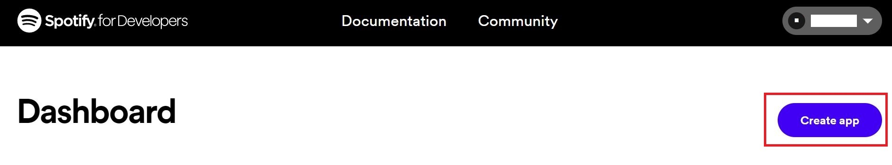
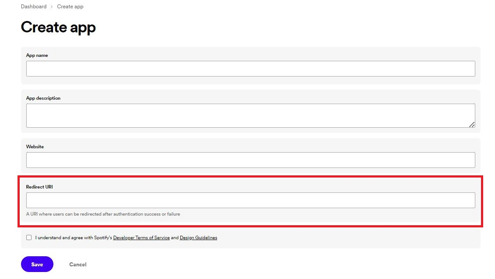
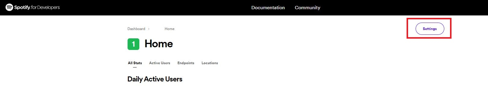
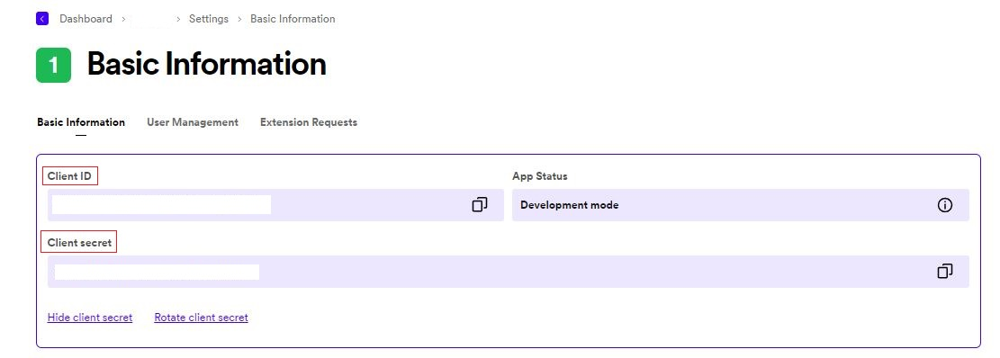
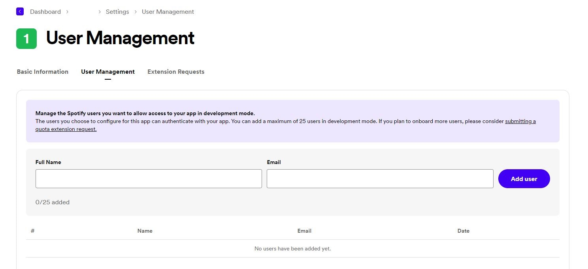

# COMPSCI 732 Project - MSc in Partying
**Party like a pro: 
Groove and share memories with the ultimate platform for hosts and guests!**

## Features
- __Music Sharing__: Sync your party with the perfect playlist. Our platform lets everyone search for their favorite music and add it to the host's playlist.
- __Game Playing__: Infuse your party with interactive fun. Everyone can contribute to the fun by adding external game links and watch the friendly competition unfold.
- __Photo Sharing__: Capture the moment and share them instantly. Our platform allows everyone to capture photos and upload them to a shared album.
- __Party Space__: Create your personalized party space that combines music sharing, games playing, and photos sharing features all in one place. Customize your party space with a name, set the time, and even denote a virtual or real-world location.

## Installation

Before you begin, ensure you have installed the latest version of Node.js, npm and local MongoDB server on your local development environment. Follow the instruction below to run the app:

1. Clone the project repository from GitHub:
    ```bash
    git clone https://github.com/UOA-CS732-SE750-Students-2023/project-group-fluffy-fireflies
    ```

2. Add a `.env` file under `backend` folder with the following variables:
    ```bash
    REDIRECT_URI = {YourRedirectURI}
    CLIENT_ID = {YourSpotifyClientID}
    CLIENT_SECRET = {YourClientSecret}
    TOKEN_SECRET = {YourTokenSecret}
    DATABASE_URI = {MongoDBConnectionURI}
    PORT = {BackendPortNumber}
    ```

    You need to setup your Spotify app, get `CLIENT_ID`, `CLIENT_SECRET` and `REDIRECT_URI`, and give access to your account by following these steps:
    1. Go to [Spotify developer website](https://developer.spotify.com/dashboard), register or  login with your Spotify account.

    2. Click 'Create App'
    

    3. Enter the information you want your app to have. One important field is the Redirect URI field(should then set the `REDIRECT_URI` in .env to this). This field specify the URI to redirect users after Spotify authentication. You should set it like this: `http://localhost:{frontend port number}/start/`. If the frontend running on port 3000, then you should set it as `http://localhost:3000/start/`.
    

    4. In your app home, go to setting, you will be able to find `CLIENT_ID` and `CLIENT_SECRET`.
    
    

    5. Go to `User Management`, add the email of Spotify account you want to access your Spotify App under development mode. A maximum of 25 is applied under development mode, you can submit a quote extension request to increase this number.
    

    Guidance to get other backend enviroment variables
    1. `TOKEN_SECRET` is a random string to encode user password. You want to ensure they are long enough so your user information will not be easily hacked. One way to create it is to user the following statement in node.js.
    ```bash
    require('crypto').randomBytes(64).toString('hex')
    ```

    2. `DATABASE_URI` is a string to connect to your local MongoDB database. If you do not change any database setting after you download, by default it is `mongodb://127.0.0.1`(for latest node version) or `mongodb://localhost:27017`(for some older node version). You should also specify the database name after the url like this `mongodb://127.0.0.1/party`

    3. `PORT` is the port number your backend app running on. It should not be the same as your frontend app port. You can set it to `3001`. If you do not set this variable, the port number will default to `3001`.
    
3. Add a `.env` file under `frontend` folder with the following variables:
    ```bash
    REACT_APP_BACKEND_PORT={YourBackendAppPort}
    REACT_APP_FRONTEND_PORT={YourFrontendAppPort}
    REACT_APP_CLIENT_ID = {SpotifyClientIDYouGetFromStep2}
    PORT = {YourFrontendAppPort}
    ```
    You can simply setting `REACT_APP_BACKEND_PORT=3001` and `REACT_APP_FRONTEND_PORT` and `PORT` to 3000.
4. If you want to try using our app as a party host, you must have a Spotify Premium account and allow that account to access your app in Spotify app user management.

5. In the `backend` folder, install dependencies:
    ``` 
    npm install
    ```
    And then start the server:
    ```
    npm run devStart
    ```
    You should see
    `Listening on port {BackendPortNumber}` in the terminal window.

    Running this command for backend testing:
    ``` 
    npm run test
    ```
6. In the `frontend` folder, install dependencies:
    ```
    npm install
    ```
    And then start the application:
    ```
    npm run start
    ```
    You should see the application running under `localhost:{YourFrontendAppPort}`.
    
    Running this command for backend testing:
    ``` 
    npm run test
    ```

## Usage
- If you are a party host, you will:
    - Register on the website
    - Choose your role as a `host`
    - Login with your Spotify account (You must have a Spotify Premium account)
    - Add your party name,time and location
    - Enter your party space
    - Distribute the 4-Digit Party Room Code to your guests
    - Wait for others to join your party space
- If you are a guest, you will:
    - Register on the website
    - Choose your role as a `guest`
    - Enter the 4-Digit Party Room Code that the host gives to you
    - Enter the party space and enjoy sharing the music, game and photos

## Group members
- Ting-Ying Wang (twan108): Project Manager and Frontend Developer
- Zushuai(Derek) Zhang (zzha248): Backend Developer
- Shitong Hua (shua445): Frontend Developer
- Jiaqi Luo (jluo396): Designer and Frontend Developer
- Hao Zhong (hzho561): Frontend Developer

## Resources
- [Meeting Minutes](https://github.com/UOA-CS732-SE750-Students-2023/project-group-fluffy-fireflies/wiki)
- [Project Board](https://github.com/orgs/UOA-CS732-SE750-Students-2023/projects/2)
- [User flow and DB schema](https://www.figma.com/file/QgjHye66DRs40dctD8kytG/Diagrams?node-id=0%3A1&t=A0IS9Xn3id1w5ojU-1)
- [UI Prototype](https://www.figma.com/proto/lCqCkMpeoR4nPByI7xLLVb/Website-Wireframes?node-id=1639-201&scaling=scale-down&page-id=1401:1984&starting-point-node-id=1639:201&show-proto-sidebar=1)